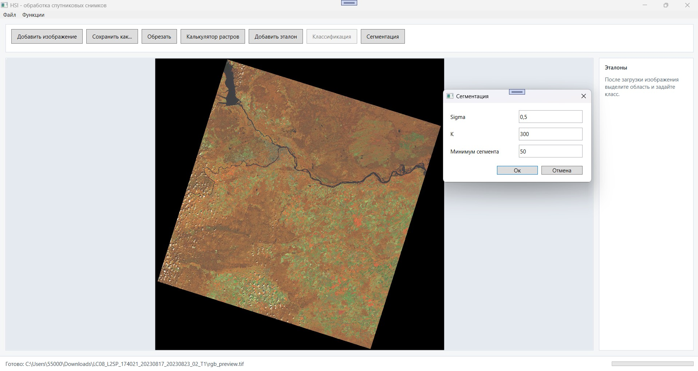
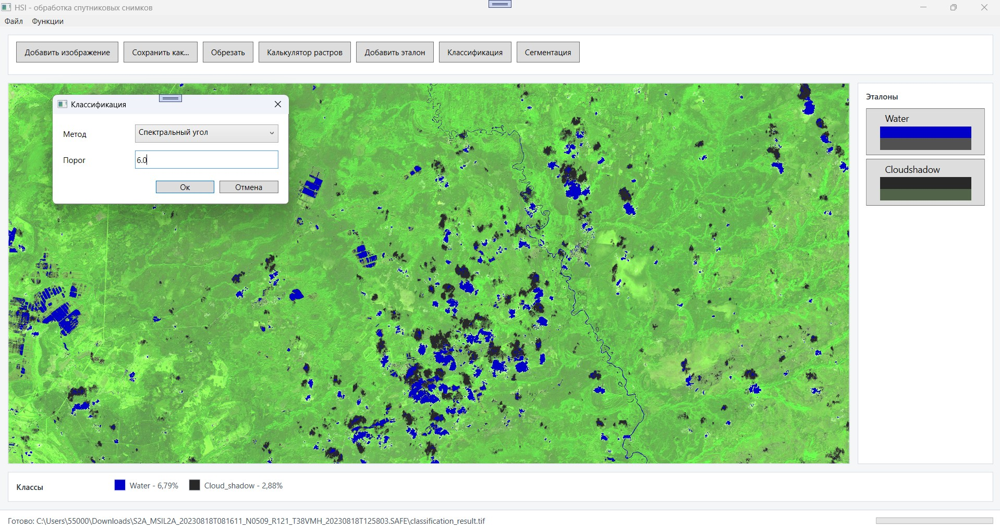

# HSI

WPF-приложение для просмотра и базовой обработки мультиспектральных и гиперспектральных спутниковых снимков.

Проект был сделан как дипломная работа: мне хотелось собрать не просто демонстрационный интерфейс, а небольшую настольную программу, которая работает с реальными данными Landsat, Sentinel-2 и AVIRIS, позволяет собирать RGB-композиции из каналов и запускать несколько алгоритмов обработки.

## Скриншоты

### Landsat

### Sentinel-2

## Что умеет приложение

- Сборка RGB-изображения из выбранных каналов спутникового снимка.
- Поддержка Landsat 8, Sentinel-2 SAFE и AVIRIS.
- Просмотр изображения с масштабированием и перемещением.
- Обрезка выбранной области снимка.
- Калькулятор растров по формуле вида `(Ch1-Ch2)/(Ch1+Ch2)`.
- Классификация по пользовательским эталонам:
  - спектральный угол;
  - евклидово расстояние;
  - барицентрические координаты.
- Сегментация изображения на основе спектрального угла.
- Построение гистограмм каналов.
- EMD
- Сохранение результатов в `.tif`.

## Примеры данных

Тестовые снимки Landsat и Sentinel-2 можно скачать с Яндекс Диска:

https://disk.yandex.ru/d/SJGqHFiBDc1z7Q

Данные не лежат в репозитории, потому что спутниковые снимки занимают слишком много места.

## Технологии

- C# / .NET Framework 4.8
- WPF
- OpenCvSharp
- LinqStatistics
- HDF.PInvoke

## Как запустить

1. Клонировать репозиторий или скачать его через `Code -> Download ZIP` на GitHub.

2. Открыть `HSI.sln` в Visual Studio.

3. Восстановить NuGet-пакеты.

4. Собрать проект через `Build -> Rebuild Solution`.

5. Запустить приложение.

Для проекта нужен .NET Framework 4.8. Если сборка через `dotnet build` падает на WPF-задачах генерации ресурсов, используйте сборку из Visual Studio/MSBuild для .NET Framework.

## Быстрый сценарий проверки

1. Скачать пример снимка из ссылки выше.
2. Нажать `Добавить изображение`.
3. Выбрать спутник, например `Landsat 8` или `Sentinel 2`.
4. Выбрать папку со снимком.
5. Указать номера каналов.
   - Для естественных цветов обычно подходят `4, 3, 2`.
   - Для псевдоцветной растительности можно попробовать `5, 6, 4` для Landsat или близкие по смыслу каналы Sentinel-2.
6. Нажать `Ок`.

После обработки программа сохранит TIFF-превью в папку снимка и отобразит результат в интерфейсе.

## Как устроен проект

- `MainWindow.xaml(.cs)` - главный интерфейс, просмотр изображения, запуск операций.
- `ImageAddingWindow.xaml(.cs)` - выбор спутника, папки и каналов.
- `ImageBuilder.cs` - сборка RGB-композиции из отдельных каналов.
- `RasterCalcs.cs` - калькулятор растров.
- `ClassifyImage.cs` - алгоритмы классификации.
- `SegmentImage.cs` - сегментация.
- `EMDImage.cs` - экспериментальная обработка AVIRIS.
- `SatelliteInfo/` - описание структуры данных разных спутников.
- `Pixels/`, `RPN/` - вспомогательные модели и разбор формул.

## Статус проекта

Это учебно-исследовательский проект, поэтому в нём есть места, которые можно улучшать, но при этом проект уже показывает полный рабочий цикл: чтение реальных спутниковых данных, обработку пиксельных массивов, визуализацию результата и сохранение выходных файлов.
